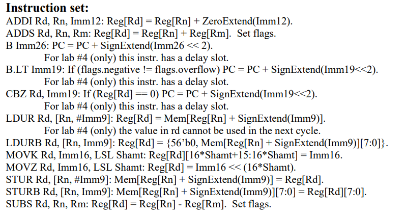
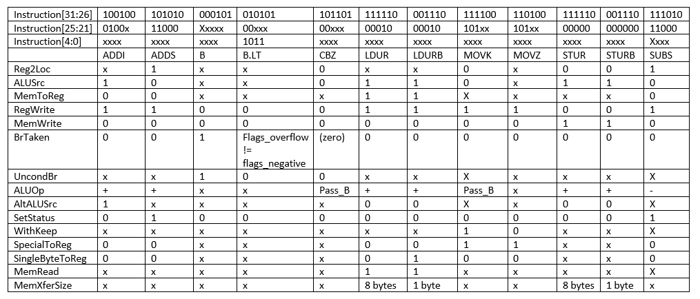
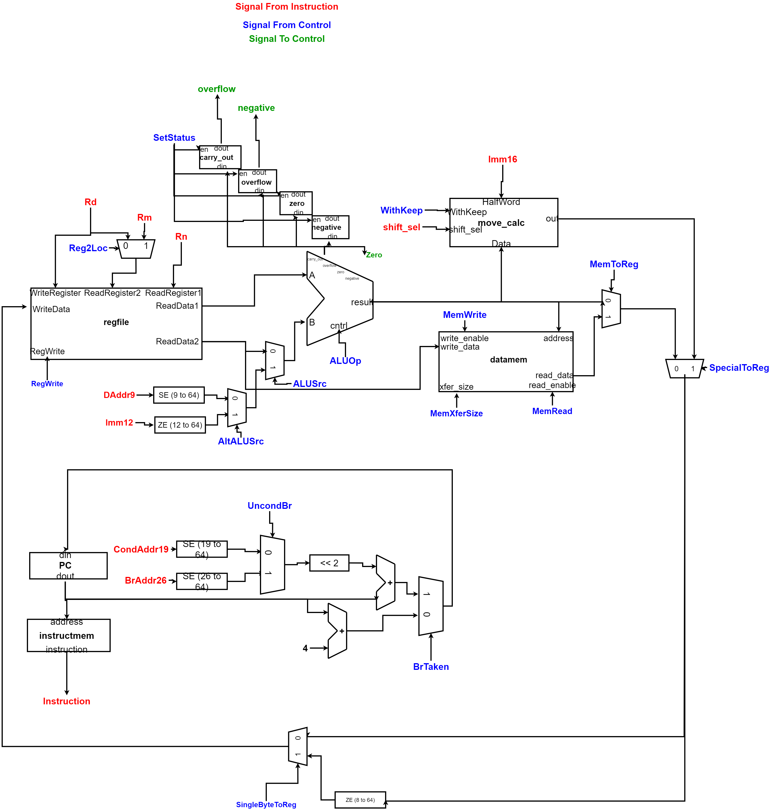

# CPU

This repository hosts a simple design (written in Systemverilog) for a CPU that implements a subset of the ARMv8 ISA.

# Instruction Set

# Control Table

# Datapath
* The datapath is written in structural Systemverilog, while control is written in RTL. 
* There is a single-cycle version of the CPU at single_cycle/
* There is a pipelined version (5 stages) of the CPU at pipelined/

**The following is the diagram of the datapath for the single_cycle cpu:**

  
  
  
  
**The following is the diagram of the datapath for the pipelined version of the cpu (5 stages):**

